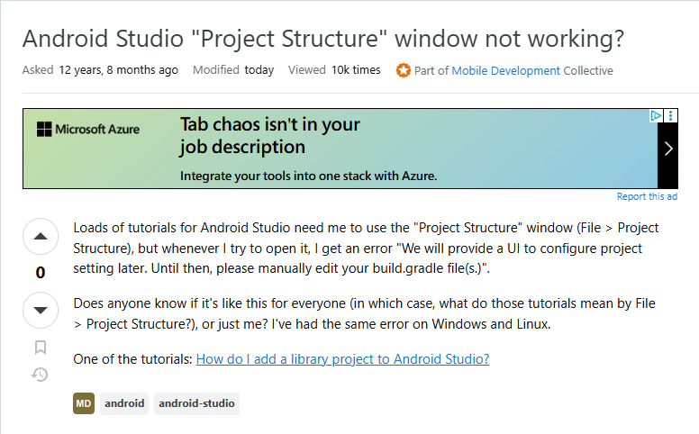

As with anything in life, software engineering will lead you down a road of new discoveries and issues to solve. No one is ever fully free from the unknown. Fortunately, a majority of the time someone else will have encountered that issue or is experienced enough to be able to aid a guiding hand, unless of course it is something entirely new, but as they say, two heads are better than one. In order to get this support, however, you must be able to ask for help, usually in the form of questions to help supplant the knowledge you lack or to provide a perspective you have failed to account for. Not all questions are made equal; however, people are unable to read minds, so how you communicate your issue plays a very important role in the responses that your question will get. Eric Raymond shows the difference between a "smart" question an a "stupid" question, focusing on the hacker community, in his essay "How to Ask Questions the Smart Way." Now it is important to note that this essay is very focused on a specific community and the norms and attitudes that are common there. It focuses on what is more likely to elicit a response and the different types of responses that you might receive. For our purposes, we can just focus on the idea that a smart question will usually be a concise affair that cuts out all manor of superfluous words and stylings in order to convey all relevant information to be had, so that both the issue and the solution can be found as quickly and easily as possible. The essay does also note that these questions must also not be trivial by themselves and show a certain amount of effort from the asker, such that it truly was an endeavor that they could not figure out from all the resources available to them, especially in our modern times, where information is so easily found. While the merits of smart questions may seem obvious, in that the more concise and informative a questions is the less time is wasted in finding solutions, it also speaks to a certain sense of community, that everybody's time is respected and a genuine desire to improve is there, rather than a triviality that is quickly used and discarded. Working towards a solution with your best foot forward allows for the underlying issues to be learned so that it can be applied to further scenarios and enrich the mind so much further.

## Smart Question Example

Here is an example of a smart question I found. It isn't exactly a perfect example to me, but it does fulfill a lot of the requirements. The subject is a bit vague as it only states 'not working'; however, it does specify the program they are using and what is causing the problem, Android Studios is having an issue with a "Project Structure" window. The tags are appropriate, indicating they usage of an android program, specifically Android Studios. The actually body of their post is practically perfect, they succinctly state the issue they are having, an error occuring everytime they tries to open a "Project Structure" window, and points to the tutorials they are using. They also attempts to see if other people are having any issues, leaving the issue of responsibility up in the air, and specifies the operating systems they have tried in order to narrow down what might be causing the issue. Of course it is rather still vague and lacks many specifications, but it feels rather servicable for the seeming scope of the issue at hand. In response, the answers have alerted the poster to common issues the program she is using has, and one commenter even attached code that worked for them in solving the issue. Though this example was rather vague at a lot of points, it still shows the importance of including as much information as you can to help figure out an issue.

Source: <a href="https://stackoverflow.com/questions/16958443/android-studio-project-structure-window-not-working">Example 1</a>

## Not so Smart Question Example

Here is an example of a question that violates the guidelines that Raymond set forth. The subject is overall simplistic, asking on how to do an action with a supposed library or language. The tags look fine. The body of the question does include some example code which is a bit of a plus, but it doesn't really give much useful information, such as what output they are recieving and what issues they have. The rest of the body also jsut poses a simple question with no indication of what they have tried and what specific issues they encounter. Overall, it seems like something that Raymond would refer to as a RTFM or STFW. There is a samaritan who actually answered and gave a nice suggestion, but a couple of the comments they recieved merely asked for clarification as it was a rather barebones post. This shows that not much can be done with this type of question other than just simply spelling out a method, and most will not be willing to do that.

Source: <a href="https://stackoverflow.com/questions/79879668/how-to-find-string-and-replace-several-sub-lines-using-sed">Example 2</a>

## Conclusion

The essay was a somewhat interesting read. Overall, I agree with its core messaging about the types of questions that are more conducive to getting good answers. It seems like something that would be obvious, but with something like the internet that is basically a vast and convenient resevoir of information, it does become quite tempting to just jump to asking questions to gather information without putting much thought into it. As much as I posture that this concept seems obvious, I too often fall into this kind of trap, where the idea of free information is so tantalizing, that I don't try to think too hard about things before just going out to gather information. Of course, that isn't exactly a wrong approach depending on how you do it and your intentions, but a bit of critical thinking goes a long way. The idea of smart questions are pretty nice, but it feels like with the way the internet is expanding the idea becomes a little less relevant as more and more people are spreading information through the internet, though I suppose it becomes all the more relevant as people are less encouraged to think critically and just take information and run with it, without bothering to search for more information. Although I suppose in this day and age, those questions aren't exactly going to people.
