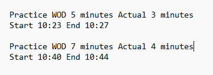

A useful metric we can all use is knowing how long it would take for us to accomplish different tasks. It is a measure of our own abilities and allows us to be able to better schedule and set expectations. In order to be able to do that better, effort estimation has been a part of all projects that I have been working on. Taking time to guess how long I would take to do something and then comparing actual time I took at the end. To be perfectly honest, it was a rather mindless endeavor that I never truly paid much time too, other than as another data point of comparison. On paper, it is very useful for all the reasons I stated before, but in practice you neverly really think about it until it actually comes into play, like when faced with hard deadlines or time limits. 

## Making Estimates

My personal endeavors in making estimates were never really a hard science, I mostly based it off of feelings at the time and the given time completion times for each of the assignments, usually basing it around average time completions. At first, when assignments were pretty easy, I was pretty fast and blew the estimated times out of the water, but as the semester went on, and assignments got harder, I took longer and longer to do assignments, until my estimations were off in that I took much longer. I never really tried to adapt my estimates other than just basing it off of the averages due to my own laziness, which is a bit of a fault of my own, but it was a small sort of motivator to try to get better, if you choose to look at it that way. In a way, these effort estimates didn't really affect me that much, but most of that is due to my own lazy methods of doing them, rather than a fault of the practice itself, which is a trap that many things fall into. As the saying goes, nothing can help you if you don't want to help yourself. My blaise attitude towards the tracking extended to my method of tracking my actual time, which was just noting what time I started at and what time I ended at. I would try to use the given stopwatch, which gave more exact times down to seconds, but most of the time, the stopwatch would freeze on my laptop for whatever reason, so I would end up with rather rough estimates based on my laptop's clock. As for AI, I never really used it because I just never really felt the urge to.

## Conclusion

Effort estimations are a rather novel idea, and could very well be very beneficial in keeping organized and scheduling things, especially with how we all love to procastinate. Through effort estimation we can give a general idea of time of arrivals for projects and help us realize when we need extensions that much sooner. It does however require us to care about these things. If I were to do these effort estimations again, I would try to be a bit more rigourous with it and try to give my estimations a bit more thought. I might even try to use an actual stopwatch program or something, though that doesn't really seem that necessary. When we know our own limits, we are able to push them further and further, until we are able to reach new and new heights with our own efforts.
