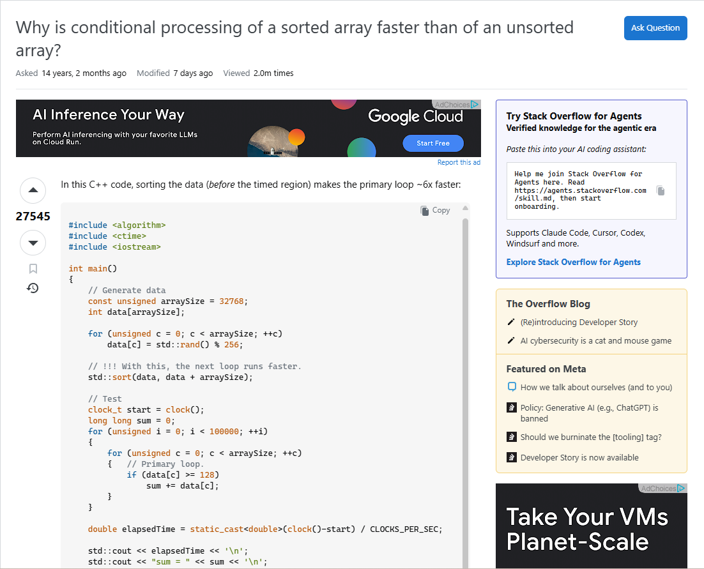
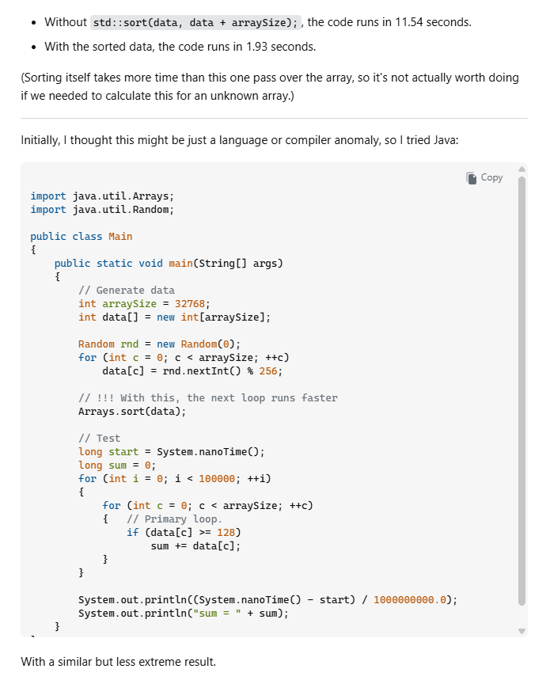
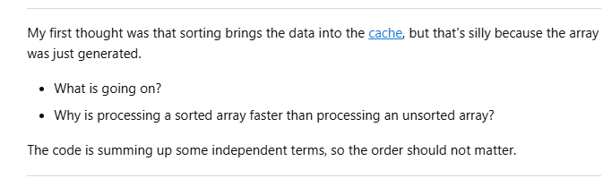
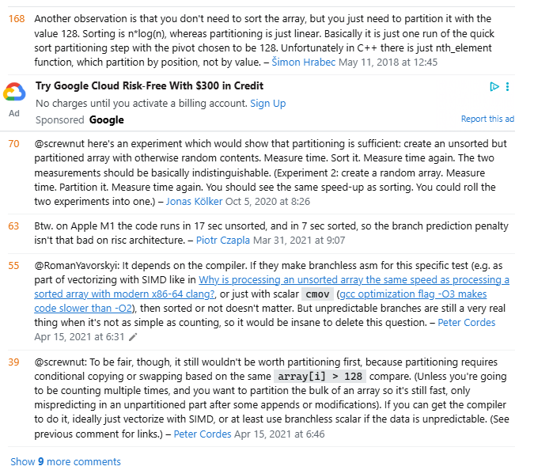
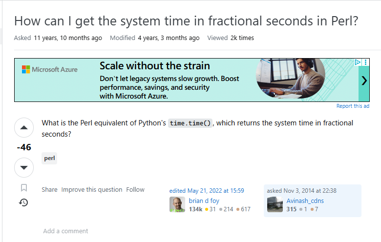

Questions are an inevitability in life. No one person will know everything and have encountered every issue, especially when trying something new. Fortunately, we are not alone in our existence and there are many people who have encountered many issues similar to what we have, with some exceptions of course, but even then, as the adage goes, two heads are better than one. The biggest barrier to getting help; however, is usually communication. No two minds are the same and no one else will be able to know your perspective, so you must try to convey your issues in whatever way you can. The most common of course being questions. A simple question will not always grant you what you seek; however, so in order to get the best results, you must convey as much information as you can. Eric Raymond gives his perspective on what a "smart" question is in his essay "How to Ask Questions the Smart Way," though it does focus heavily on the hacker community. Despite this focus, it still lays out a pretty good foundation for what a question should include. Raymond does focus on being concise and cutting out superfluity on the mindset of getting to the actual important information. He also harps upon the fact that questions must not be trivial affairs and that the question poser must prove that they had adequately attempted to solve the problem by themselves and looked at all the relevant resources that they could in order to not waste peoples time on an issue that is easily solvable with a few minutes of googling or looking through manuals. It is also important to not give as much information about what you have done and what tools you are using so as to give a better idea of what the issue might truly be. It is also important to not appear pompous and assume, anything could be the cause so do not point at anything specific and just lay out all the facts. This might seem rather obvious at first sight, but it truly highlights that questions are not a trivial affair, but a matter of community and whether you are taking others kindness for granted or are genuinely trying to learn and improve. We must all work hard towards solving our own problems and put our best foot forward, a question is not a weakness, but it is also not to be taken for granted.

## Smart Question Example

Here is an pretty good example of a smart question. Granted, this is less of someone looking for help, and more just someone that is curious, but it is still within the spirit of learning more. They have a very clear and concise question and have provided multiple examples with multiple coding languages in order to show something they noticed and was curious about. They were curious about speed and used an example with C++ a language considered to be very fast, and then an example with a slower, but still rather fast language Java. This shows a curiosity and willingness to learn, as well as, the fact that they have experimented a bit with the topic and noticed a trend in their code, wanting to learn more about it. They then posit their own hypothesis and ask clarifying questions about the cause behind the speed differences. Their tagging was also very clear noting the languages they used and the relevant topics. They could have also included what hardware they were using as that also factors into speed, I have heard, but I am unfamiliar with the topic so I do not know how much that would factor into this, but it would have been a nice detail to include.

Due to this question it spawned a lot of discussion as seen in these comments. There were also a lot of answers which were very interesting and thorough such as a long thread about branch prediction which was very informative.

Source: <a href="https://stackoverflow.com/questions/11227809/why-is-conditional-processing-of-a-sorted-array-faster-than-of-an-unsorted-array">Example 1</a>

## Not so Smart Question Example

Here is an example of a question that violates the guidelines that Raymond set forth. The subject is overly simplistic, and something that should be easily looked up. They simply were looking for a function in the language they were using. It is very barebones and does not inspire anything to interesting in way of answers. Now fortunately for this person, people are nicer than stated in Raymond's essay, so they still got an answer, but it was a very quick one line, here's an equivalent function. It could have just as easily inspired what Raymond calls a RTFM or STFW due to its simplistic nature. Though it was nice that it got answered if more questions of this nature clogged up the forums it would be very difficult to find anything worthwhile to look at.

Source: <a href="https://stackoverflow.com/questions/26724585/how-can-i-get-the-system-time-in-fractional-seconds-in-perl">Example 2</a>

## Conclusion

SMART questions as a concept seem rather obvious, but it does highlight how useful the etiquette of these types of questions can be in order to inspire good answers and discussion. We can take asking questions for granted because it is such an easy wat to gather information, but in the interest of gathering as much information we can, it is important that we evaluate how much me are giving and whether we are actually trying. The essay provided an interesting perspective despite how blunt the tone seemed throughout. At its core these questions are meant to inspire more critical thinking so that discussion is not bogged down by mindless blather. The idea of smart questions are pretty nice, but it feels like with the way the internet is expanding the idea becomes a little less relevant as more and more people are spreading information through the internet, though I suppose it becomes all the more relevant as people are less encouraged to think critically and just take information and run with it, without bothering to search for more information. Although I suppose in this day and age, those questions aren't exactly going to people.
