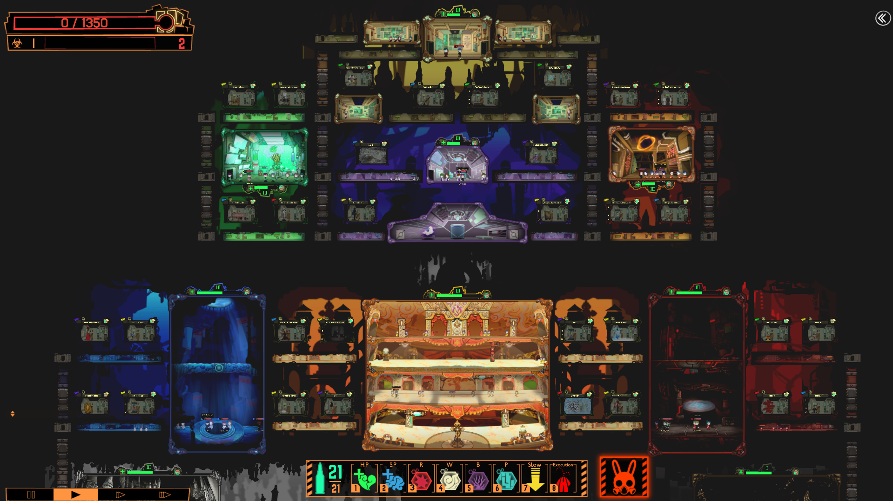

*A screenshot of Day 41 in-game*

This one is a bit of a long shot, but I have lost a lot of my old files, and I didn't really have a lot of projects to begin with, so this is my defense of why this is here. Although Lobotomy Corporation is a game, it is a brutally difficult management simulator where you must carefully manage a facility full of creatures called abnormalities by sending employees to work with them. The goal is to collect enough energy to meet each days quota, with more difficult abnormalities usually giving more energy. The amount of energy you can get from an abnormality depends on an employees work result with the abnormality, and work result is dependent on a combination of the Temperance stat, which improves work success rate, and the abnormalities preferred work type associated with the associated stat at different ranks, which is usually more important. While many early abnormalities success rates scale linearly with the rank of their preferred stat, some are more tricky and prefer a certain stat rank, so you need a healthy mix of different stat values across employees to be able to optimally play the game, especially since one of the main ways to raise stats is to perform the associated work type with an abnormality. Performance is graded based on the number of surviving employees, though grades only matter for how many lob points you earn at the end of the day which allow you to either hire more employees or raise the rank of an existing employees stats. Each abnormality also has a gimmick, many of which result in instant death for the employee managing them. For example, early on you may encounter Punishing Bird, who is of the second lowest of the five tiers of abnormality. His gimmick is that he can randomly breach his containment unit at any time as his qlipoth counter (a counter that can gets lowered based on different conditions per abnormality and results in a breach when it reaches zero) has a chance to lower everytime an abnormality other than itself is worked with. Fortunately, he does very minor damage while breached and will eventually return to his containment unit if left alone. However, if Punishing Bird is attacked while he is breaching he will enter a state where he can practically instantly kill any of your employees with a single attack. Most of the time these gimmicks deal with the employees stats and work success. An example of this can be seen with one of the abnormalities that you may encounter around mid game, The Silent Orchesta, who is of the highest abnormality tier. His gimmick is that his qlipoth counter lowers every time you have a great work success or a work failure, so you must only get an average work result with him. Additionally, every time he breaches he will go through four phases where his damage immunities and weaknesses change, while he deals heavy sanity damage to the entire department he is in. If he is allowed to finish all four phases, then all energy collected up to that point is stolen. The player is also not allowed to pause while Silent Orchestra is breaching. While managing your employees and abnormalities you also have to worry about qlipoth meltdowns and ordeals, which have a chance to occur after a set interval of work is done with abnormalities. A qlipoth countdown merely makes it so that a set number of random abnormalities must be worked with within a certain time period or else their qlipoth counter falls to zero immediately and they breach, which introduces another aspect of randomness that can make abnormalities you normally avoid working with due to tricky gimmicks be forced to interact with or can introduce a lot of chaos if you are unable to work with the associated abnormalities in time. Ordeals on the other hand can be akin to mini-boss fights, in which new enemies are introduced randomly throughout the halls. These enemies, or course, also have their own gimmicks, varied based on the ordeal type, ranging from simply swarming your employees to lowering qlipoth counters. In addition to all these things you must micromanage, you also have extra missions that you may choose to ignore, but in order to get the true ending you must fulfill the requests of the heads of each department, and finishing their mission lines triggers what could be considered boss fights, where your controls are messed with in some way, a very powerful enemy is introduced, or both. Of course, completeing these bosses nets you very powerful rewards, but they can be a major pain, especially since you cannot fulfill most of the other department heads missions while doing these boss fights. This is a bit of gameplay spoiler, but during the last few days of the game you have to deal with multiple of these boss gimmicks at the same time. 

To make a long story short, completing Lobotomy Corporation requires a lot of strength of will and the ability to micromanage, which are very important skills to have. You must have an eye for detail and make sure you are not overlooking something or your entire day could be ruined or you just lose an employee. Whether these skills actually translate to any real world application, especially with all the helping hands Lobotomy Corporation has that real life doesn't, the almighty pause and restart, at the very least it helps to develop a mindset to be extremely careful with everything you do.
