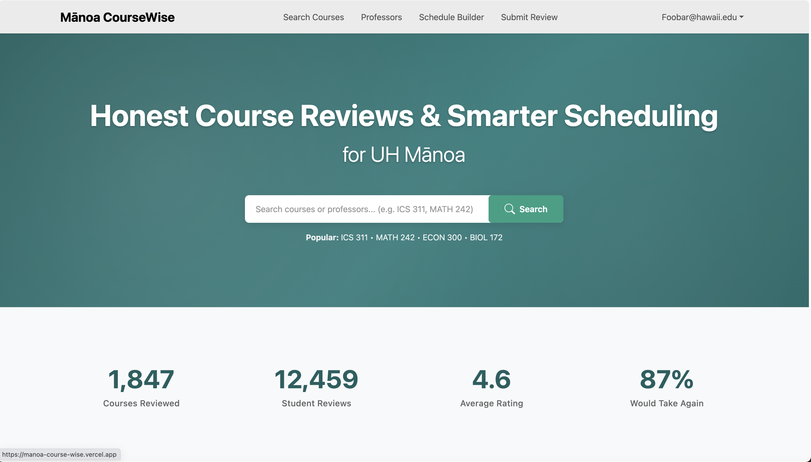
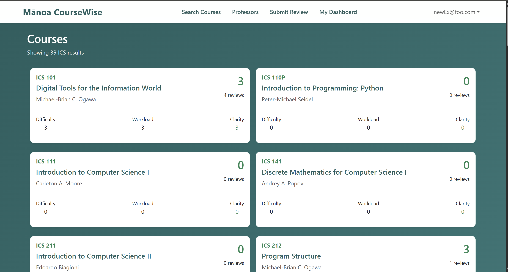
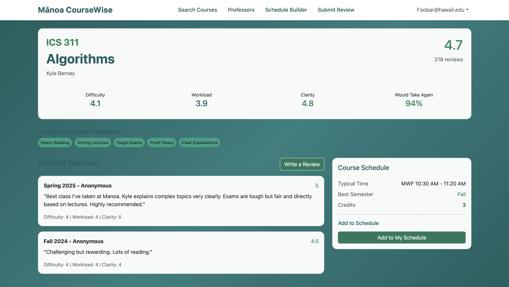

For the final project of a Software Engineering class, my group decided to make a more specialized version of RateMyProfessor for the ICS and Math classes at UH Manoa. Our goal was to create a more accurate review site that isn't as focused on negativity. Due to time constraints, our website isn't as expanisve or have all the feautrues of RateMyProfessor. The bulk of the website is the course search page, which lists all the ICS and Math courses at UH Manoa alongside one of the professors for the course and their ratings. Once you click on a course, it will redirect you to that courses page where you can see more detailed information and actual reviews left by other users. If you would like to look for a specific professor, they are all listed on the Professor's page on a table where they are grouped with their respective classes. You can also save courses to your profile. 

Most of the work that I did for the project was implementing the course search page, professors page, and the basic design for the course details page. I also reviewed the site's design and made suggestions for different design aspects and changes to be made for a more comprehensive and appealing design. I also implemented the search bar functionality so that it redirected and filtered the courses in the course search page. I designed the course search and course details pages based off the mockups created by our group. 

This was a pretty fun project that helped teach teamwork and orgainzation, so that our group would meet regularly each week and efficiently complete our tasks so that we would have a functioning product by each deadline. Making sure we all did our work helped so that no one fell behind due to someone else's tasks not being finished. I also learned a lot about how to implement a search bar and filtering.

Source: <a href="https://manoa-coursewise.github.io/manoa-course-wise.github.io/#user-guide">Manoa Coursewise</a>
